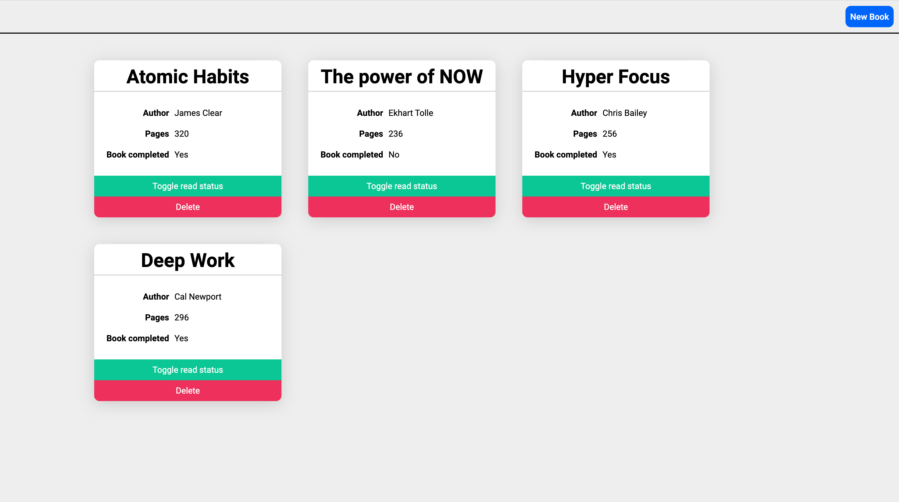

# Project: Library
  This is a simple application that lets you store the books you have read or want to read.
## Skills learned during this project
- Organizing my code using JavaScript object constructors. 
- I learned about JavaScript's object prototype. 
- I learned about Prototypal inheritance, although it is not used in this project. There simply isn't a need for it here. 
- I learned how to efficiently implement Prototypal inheritance using Object.create() 
- I learned about Object.assign() 
- I learned that Objects have enumerable, and non-enumerable attributes as well as owned-properties or inherited-properties. 
## You can view the app by [clicking this link](https://bshowen.github.io/project-library/)!
## JavaScript Documents
Read about [Object.assign()](https://developer.mozilla.org/en-US/docs/Web/JavaScript/Reference/Global_Objects/Object/assign)
Read about [Object.create()](https://developer.mozilla.org/en-US/docs/Web/JavaScript/Reference/Global_Objects/Object/create)
Read about [Object.prototype.hasOwnProperty()](https://developer.mozilla.org/en-US/docs/Web/JavaScript/Reference/Global_Objects/Object/hasOwnProperty)
Read about [Object.prototype.propertyIsEnumerable()](https://developer.mozilla.org/en-US/docs/Web/JavaScript/Reference/Global_Objects/Object/propertyIsEnumerable)